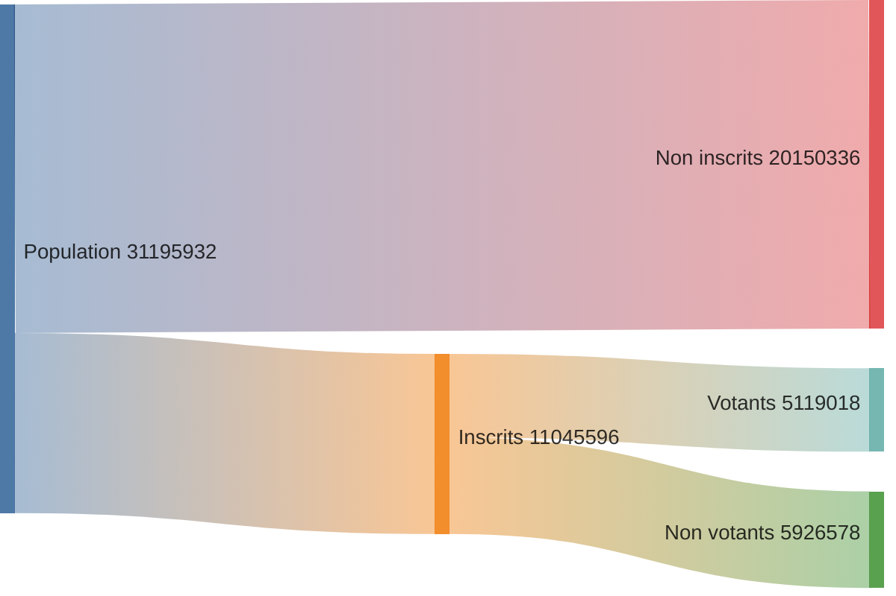
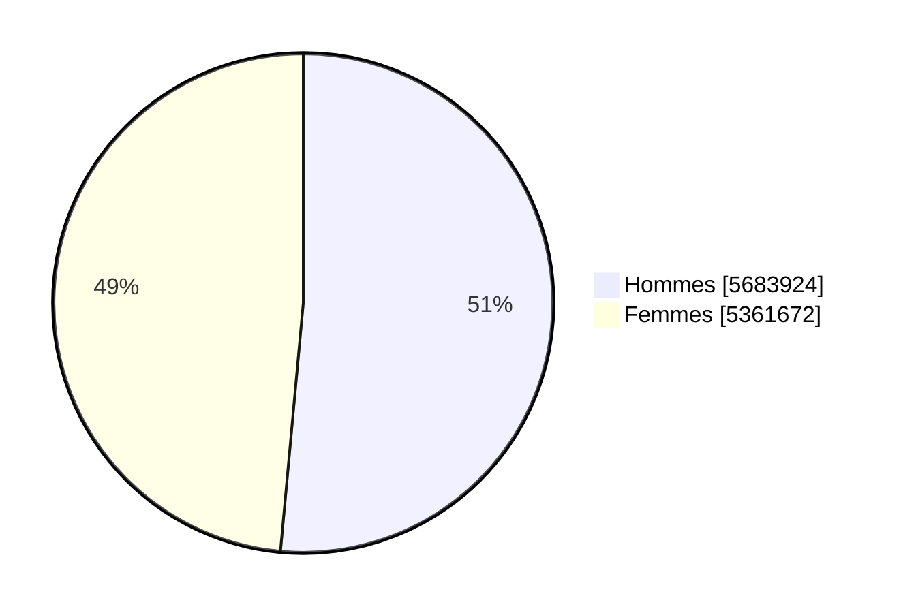
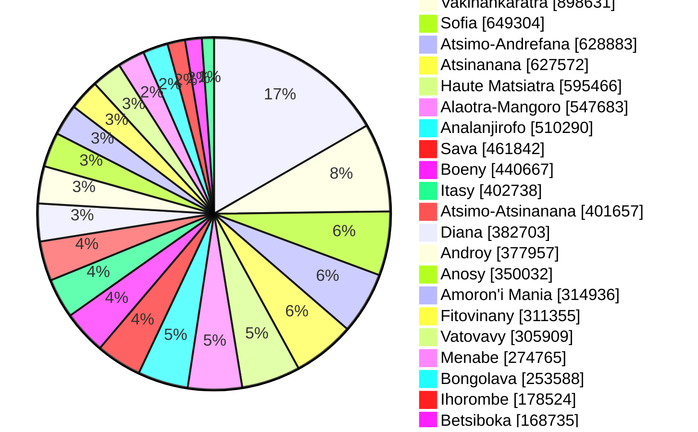
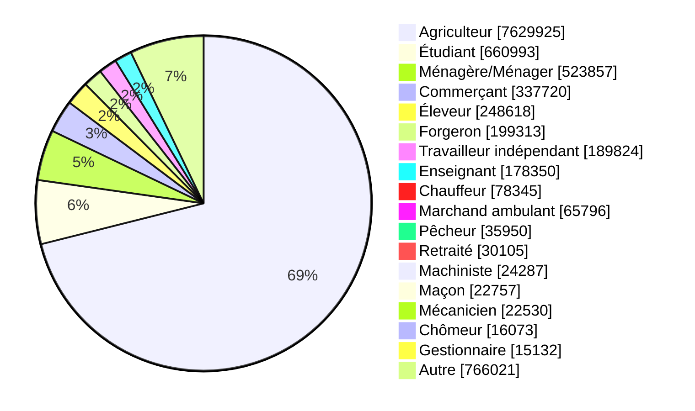
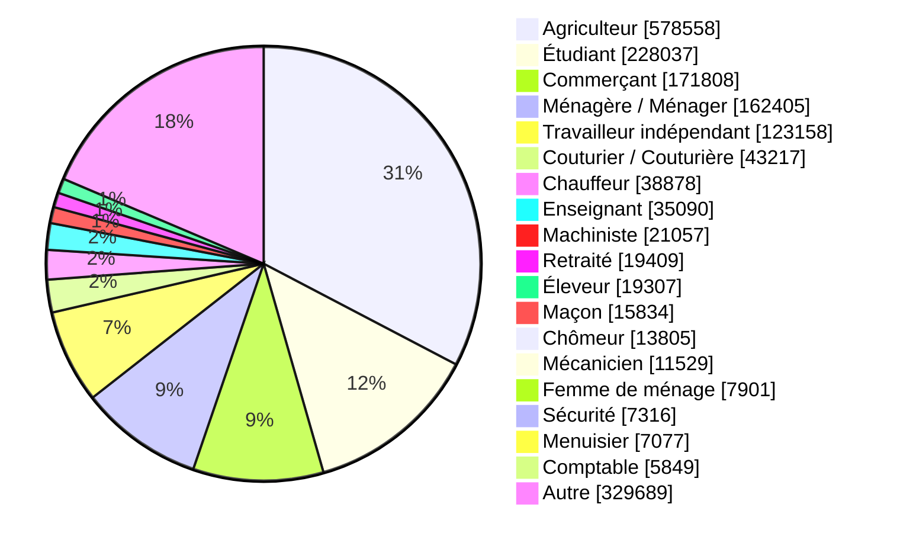

# Élection présidentielle 2023
## Statistiques générales

On observe seulement un taux de participation de **~46,35%**.

-------------------
## Répartition par sexe

-------------------
## Répartition par région

-------------------
## Répartition par catégorie socio-professionnelle

### National

### Analamanga

Si les argiculteurs représentent près de **70%** au niveau national, ils ne représentent qu'environ **31%** dans la région Analamanga.

**Sources**: [CENI](https://www.ceni-madagascar.mg/), [INSTAT](https://www.instat.mg/)